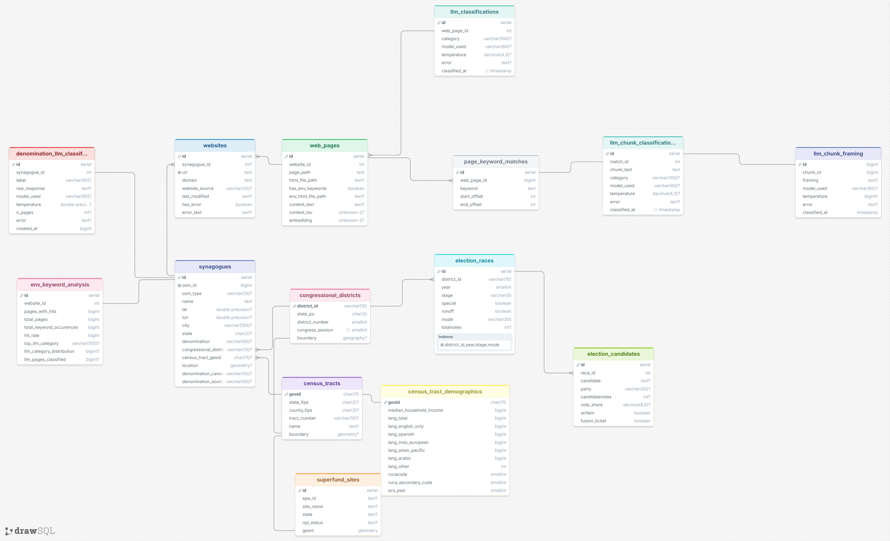

# Synagogue Environmental Action Pipeline

A research pipeline that collects US synagogue websites, crawls their content, and uses LLM-based classification to study environmental action across Jewish congregations — linked to congressional districts and election data for political analysis.

## Database Schema



The PostgreSQL database stores synagogues, their websites, crawled pages, keyword analysis results, LLM classifications, congressional districts, census tracts, and election results.

## Pipeline Overview

The core pipeline runs sequentially through the numbered collection/classification
stages (01–09). Stages 10+ are cross-cutting analysis and validation layers that
operate on the chunk-level classification data in the database rather than feeding
the linear flow.

```
01_osm_scraping → 02_cross_referencing → 03_google_places → 04_combined
                                                                   ↓
                                                        05_web_scraping (BFS crawl)
                                                                   ↓
                                  06_environmental_classification (keyword spans + semantic filter)
                                                                   ↓
                       07_LLM_categorization (Gemini chunk-level judge → 76 action labels → 9 categories)
                                                                   ↓
                                                08_database (PostgreSQL + pgvector)
                                                                   ↓
                                          09_figures · 11_analysis (analysis plots & stats)

Cross-cutting layers over the chunk-level data:
  10_/11_human_validation        keyword/semantic filter vs human ground truth; XGBoost; Gemini-vs-human
  12_denominations               denomination_canonical: tag → America baseline → LLM backfill
  13_embeddedvsimplictvsexplict  Implicit/Explicit/Embedded framing of each confirmed action chunk
```

> **Classification rework.** The original page-level LLM-as-a-judge (one verdict
> per HTML page, via Claude Haiku / Cohere Command-A) has been superseded by a
> **chunk-level** pipeline: every keyword hit is recorded as a text span
> (`page_keyword_matches`), and a context window around each span is classified
> individually (`llm_chunk_classifications`). The page-level scripts remain in the
> tree as legacy. See stages 06–07 below.

### Stage 01 — OSM Scraping (`01_osm_scraping/`)

Queries the OpenStreetMap Overpass API for all US Jewish places of worship. Outputs `synagogues_us_all.csv` with name, coordinates, city, state, denomination, and OSM ID.

### Stage 02 — Cross-Referencing (`02_cross_referencing/`)

Enriches the OSM dataset with websites from three additional sources:
- **Wikidata SPARQL** — coordinate and name+state matching
- **Wikipedia** state synagogue lists — scraped for all 50 states + DC
- **Denomination directories** (`directory_harvest.csv`) — URJ and similar harvests

Outputs `synagogues_us_enriched.csv`. Also adds census tract and congressional district identifiers (`add_census_tracts.py`, `add_congressional_districts.py`). Also populates `census_tract_demographics` with ACS 5-Year 2023 income and language composition and USDA RUCA 2020 urbanicity codes (`add_census_demographics.py`).

`cross_reference_america.py` cross-references the combined list against a manually-curated source (`America_rvest_csv.csv`), matching on URL normalization then name+state Jaccard similarity. Outputs `america_matches.csv` and `america_only.csv` (records present only in the manual source).

### Stage 03 — Google Places (`03_google_places/`)

Searches the Google Places API (v1) for synagogues using adaptive quadtree decomposition over a 1°×1° seed grid covering the contiguous US. Each tile issues a `places:searchText` request with `locationRestriction.rectangle` (strict bounds); whenever a tile returns a full page of results (≥20), it splits into four quadrants and recurses, down to a ~5.5 km floor. This recovers high-density urban synagogues that relevance-ranked searches miss when the 60-result cap is hit.

`search_synagogues_targeted.py` re-seeds only tiles with prior hits to focus API budget on known-active areas (~ per targeted run).

Outputs `google_places_raw.jsonl` (one JSON object per place) and `google_places_synagogues.csv`.

### Stage 04 — Combined Dataset (`04_combined/`)

Merges OSM+enriched and Google Places records into `synagogues_combined.csv`, deduplicating on coordinates and name. This is the canonical input for all downstream stages.

### Stage 05 — Web Scraping (`05_web_scraping/`)

BFS-crawls each synagogue website (up to 150 pages per site, 10 concurrent workers) and saves HTML to `html_pages/<domain>/`. Skips media files and already-downloaded pages for safe resumption.

### Stage 06 — Environmental Classification (`06_environmental_classification/`)

Identifies the pages — and, for the chunk pipeline, the exact text spans — that contain environmental content.

**Keyword scan** (`keyword_search.py` / `classify_environmental.py`) — mirrors the matching logic from the original `America_rvest.Rmd`: `keywords.txt` gives exact word matches (`\bword\b`) and `keyword_variations.txt` gives prefix matches (`\bprefix\w*\b`, e.g. `recycl*`). Beyond a per-page hit flag, every individual hit is recorded as a span — `(keyword, start_offset, end_offset)` over `web_pages.content_text` — in the **`page_keyword_matches`** table (`08_database/migrate_add_keyword_matches.py`). These spans are the unit of work for the chunk-level LLM judge in Stage 07.

**DB-native hybrid filter** (`semantic_filter.py`) — requires embeddings to be populated first (`08_database/embed_pages.py`). Runs a single SQL query that passes a page if it matches *either*:
1. **High-confidence FTS** — `to_tsquery` match on high-precision stems (`hazon`, `compost`, `solar`, `recycl`, `carbon`, `photovoltaic`, `tashchit`, `tu_bishvat`, etc.) that have near-zero false-positive rate in synagogue content.
2. **Cosine similarity** — the page's `all-MiniLM-L6-v2` embedding (384-dim) is within `--threshold` of an averaged environmental query vector (default 0.30). The query vector is the mean of four representative phrases such as *"composting recycling waste reduction eco-friendly"*.

The keyword scan outputs `classifying_environmental_action.csv` (pages-with-hits, total pages, and hit rate per domain); the semantic filter also updates `web_pages.has_env_keywords` in the database. `keyword_count_chunking/` holds an in-progress variant of these scripts that works directly from DB `content_text` (untracked).

### Stage 07 — LLM Categorization (`07_LLM_categorization/`)

Uses an LLM-as-a-judge to classify environmental actions. The current pipeline operates at the **chunk** level, one verdict per keyword span rather than one per page:

**Chunk classification** (`run_chunk_classifications.py`) — for each span in `page_keyword_matches`, a context window is cut from `web_pages.content_text` (extends ±`pad` chars from the span, capped at the midpoint to the nearest neighbouring span so adjacent chunks never overlap). Each window is sent to the judge and the verdict is written to **`llm_chunk_classifications`** (one row per span; resumable — already-classified spans are skipped). The judge is **`gemini_as_a_judge.py`** (Gemini 3.1 Flash-Lite), whose 76-label system instruction is cached via Gemini's Context Caching API so repeat calls pay only cache-read rates.

The judge assigns one of **76 fine-grained action labels** (the action taxonomy used by the source coding scheme), or **N/A** if the chunk is not a real environmental action. `08_database/migrate_add_major_category.py` then buckets each label into one of nine **major categories** (persisted as `llm_chunk_classifications.major_category`):

| Category | Description |
|---|---|
| Community | Environmental community building |
| Spirituality and Worship | Religion-integrated environmental practice |
| Kitchen | Food and kitchen sustainability |
| Waste | Waste reduction initiatives |
| Energy | Renewable energy and conservation |
| Operations and Maintenance | Structural/operational changes |
| Environmental and Climate Justice | Equity-focused environmental work |
| Water | Water conservation |
| Other | Does not fit above categories |

The bucketing rules live in one place — `classify_action` / `_RULES` in `11_analysis/recreate_existing/recreate_common.py` — and the migration imports them, so the mapping is never duplicated.

**Legacy page-level judges** remain in the tree for comparison: Cohere Command-A+ (`command_a_as_a_judge.py`), Claude Haiku (`run_haiku_classifications.py`), and an earlier Gemini page judge (`run_gemini_classifications.py`); `compare_fresh_both_models.py` and `compare_haiku_vs_gptoss.py` cross-check models against each other and the human baseline.

### Stage 08 — Database (`08_database/`)

Loads all data into PostgreSQL (via Docker Compose). Key features:
- `pgvector` extension for semantic search with `all-MiniLM-L6-v2` embeddings (384-dim)
- Generated `tsvector` column on `web_pages.content_text` for full-text search
- 3NF-normalized election data from the Harvard Dataverse MIT election returns dataset
- `embed_pages.py` populates vector embeddings; `populate_content_text.py` extracts plain text from HTML
- Run `migrate_add_census_demographics.py` once after `load_data.py` to create the `census_tract_demographics` table (ACS income, language, RUCA codes).

One-time migrations add the chunk-level classification layer (run in order, each idempotent):

| Migration | Creates |
|---|---|
| `migrate_add_vector.py` | enables `pgvector` and adds the embedding column (prerequisite for `embed_pages.py`) |
| `migrate_add_crawl_errors.py` | adds `websites.has_error` / `error_text` (crawl-outcome tracking) |
| `migrate_add_keyword_matches.py` | `page_keyword_matches` — one row per keyword hit (keyword + char offsets) |
| `migrate_add_llm_chunk_classifications.py` | `llm_chunk_classifications` — one row per classified chunk (76-label `category`) |
| `migrate_add_major_category.py` | adds & populates `llm_chunk_classifications.major_category` (9-bucket) |
| `migrate_add_page_chunk_classifications.py` | `page_chunk_classifications` — the alternative fixed-window chunking method, see below |
| `migrate_add_page_chunk_framing.py` | `page_chunk_framing` — framing for the `page_chunks` method, parallel to `llm_chunk_framing` |
| `migrate_add_denomination_canonical.py` | adds `synagogues.denomination_canonical` + `denomination_source` (see Stage 12) |
| `13_embeddedvsimplictvsexplict/migrate_add_llm_chunk_framing.py` | `llm_chunk_framing` — Implicit/Explicit/Embedded framing per chunk (see Stage 13) |

> **Alternative chunking method: `page_chunks`.** `llm_chunk_classifications`
> only ever gets a row for pages with a keyword hit (`page_keyword_matches`).
> `populate_page_chunk_classifications.py` instead splits **every** crawled
> page's `content_text` into fixed 500-char whitespace-snapped windows and
> classifies each one independently — the point being to also catch cases
> the keyword scan missed entirely. `chunk_common.py` (stdlib-only) provides
> the shared `chunk_text()` used by both the production script and the
> `06_environmental_classification/chunk_*` research scripts that validated
> the method. Framing for this method is populated by
> `13_embeddedvsimplictvsexplict/run_page_chunk_framing_classifications.py`.
> The `11_analysis/` scripts expose both sources via `--source
> {keyword_chunks,page_chunks}` (default `keyword_chunks`); `page_chunks`
> output is written to a `page_chunks/` subdirectory alongside the default
> output, since the two sources measure different things and neither
> supersedes the other — see `11_analysis/KNOWN_DATA_ISSUES.md` and
> `11_analysis/page_chunks/README.md`.

### Stage 09 — Figures (`09_figures/`)

Final analysis figures for the research paper:

| File | Content |
|---|---|
| `figure1_framing.png` | Environmental action framing across congregations |
| `figure2_categories.png` | LLM category distribution |
| `figure3_denomination.png` | Environmental engagement by denomination |
| `figure4_political_lean.png` | Environmental action vs. district political lean |
| `superfund_similarity_correlation.png` | Mean cosine similarity vs. distance to nearest EPA Superfund site (Pearson + Spearman, raw and log-transformed distance) |

`superfund_similarity_correlation.py` fetches 2,114 EPA Superfund site boundary polygons from the ArcGIS FeatureServer, loads them into a PostGIS table (`superfund_sites`), and computes per-synagogue mean cosine similarity against `ST_Distance` to the nearest site boundary. Results: Pearson r = −0.028 (p = 0.21), Spearman ρ = −0.008 (p = 0.73) — no significant relationship.

> Most current analysis now lives in **`11_analysis/`** (below), which works off the chunk-level `llm_chunk_classifications` data rather than the page-level outputs `09_figures/` was built on.

### Stage 10 — Human Validation (`11_human_validation/`)

Validates the automated filtering and classification against a human-coded ground truth (`America_Orig.csv` / `America_results.csv`, the manual baseline). `label_tool.py` and `review_tool.py` are keyboard-driven CLI labelers used to build `human_labels.csv` and review filter edge-cases.

- `filter_vs_ground_truth.py` — precision / recall / F1 for the keyword scan and the semantic filter (threshold 0.25) over the ~22,386 pages present in both the DB and the human set.
- `classify_union.py` — runs the LLM judge on the union of keyword- and semantic-matched pages and reports agreement with the human labels.
- `train_xgboost.py` — XGBoost classifier on the raw 384-dim MiniLM embeddings (focal loss, undersampled negatives, 60/20/20 split) as an alternative to the keyword/semantic filter; model saved to `xgboost_focal.ubj`.
- `gemini_vs_human/` — evaluates the Gemini judge against the human baseline (precision, recall, F1, accuracy, Cohen's κ).

> `10_human_validation/` is a near-duplicate earlier copy of this folder; `11_human_validation/` is the current one. Worth consolidating.
>
> `human_labels.csv` (and the raw `America_*` baseline files) are not distributed in this public snapshot — they contain personal contact information for congregation volunteers collected during manual review, and are excluded for privacy.

### Stage 11 — Analysis (`11_analysis/`)

Recreates a prior human-coded study's analyses on the chunk-level DB data, plus original geospatial / political analyses. An *action* is a chunk classified as a real environmental action (`category <> 'N/A'`); an *active synagogue* is one with ≥ 1 successfully crawled page. Outlier handling (z-score on `log1p(action count)`) is centralized in `recreate_existing/recreate_common.py` — see **`KNOWN_DATA_ISSUES.md`** for the rationale and the Mardia normality caveat.

`recreate_existing/` reproduces the prior study's figures/tables — overview, categories, clustering, denomination, framing, and political analyses (`analysis_*.py`, each emitting a `*.json` + `fig_*.png`); see `goals.md` and `thesis_summary.md` for the questions and source-study summary.

Original analyses in the folder root:

| Script | Output |
|---|---|
| `state_action_map.py` | choropleth of % active synagogues per state (`--gray-low-sample` variant) |
| `synagogue_action_pointcloud.py` | per-synagogue scattergeo coloured by `log(1+action count)` |
| `synagogue_denomination_map.py` | per-synagogue map coloured by denomination |
| `action_vs_osm_distance.py` | Spearman of action count vs distance to 7 OSM environmental site types (Bonferroni-corrected) |
| `action_logit_osm_distance.py` / `action_logit_table.py` | logistic regression of has-action on OSM distances; rendered coefficient table |
| `action_distance_cornerplot.py` | scatter-matrix of the 7 OSM distances coloured by action count |
| `action_political_leesL.py` | Lee's L bivariate spatial association between district political lean and action count |
| `action_vs_dem_district.py` / `rd_action_means.py` | has-action vs Democratic district; mean action counts in Dem vs Rep districts |

### Stage 12 — Denominations (`12_denominations/`)

Populates `synagogues.denomination_canonical` (normalized into fixed buckets) through three precedence-ordered layers, each tagged in `denomination_source` for full reversibility:
1. **`tag`** — the synagogue's own OSM/source denomination tag (`08_database/migrate_add_denomination_canonical.py`).
2. **`America-Orig`** — backfill from the human baseline (`08_database/backfill_denomination_from_america.py`).
3. **`llm`** — `classify_denominations_llm.py` runs Gemini over crawled site text for synagogues still `NULL`, writing every verdict to its own `denomination_llm_classifications` table (lower layers always win).

`remove_messianic.py` retags Messianic / Chabad sites from content; `export_*` scripts produce review samples for manual QA.

### Stage 13 — Framing: Implicit / Explicit / Embedded (`13_embeddedvsimplictvsexplict/`)

Adds a framing axis (Baugh 2019; Caldwell et al. 2022): for each confirmed-action chunk, *how* the action is framed — **Explicit** (stated environmental goal), **Embedded** (incidental to religious practice), or **Implicit** (environmental effect but neither framing). `framing_judge.py` (Gemini 3.1 Flash-Lite) is run over all non-N/A chunks by `run_chunk_framing_classifications.py` (resumable) into the **`llm_chunk_framing`** table; `run_framing_fewshot_overwrite.py` re-runs all chunks with the few-shot prompt. `compare_command_a_framing.py` / `compare_mistral_framing.py` and `analyze_framing_agreement.py` assess inter-model agreement and a 3-way Fleiss's κ against the human labels.

## Setup

**Dependencies**

```bash
pip install -r requirements.txt
```

`requirements.txt` (repo root) covers every third-party import used across
the pipeline — scraping, geospatial, plotting, the DB layer, and the LLM
judge SDKs — pinned to versions verified against a working environment.

The recreation scripts in `11_analysis/recreate_existing/` pin their own
versions separately — see `11_analysis/recreate_existing/requirements.txt`
and run them with the venv in that folder.

**Environment variables** (`.env` in project root)

```
COHERE_API_KEY=...
NEMOTRON_API_KEY=...        # OpenRouter key for Nemotron
ANTHROPIC_API_KEY=...       # legacy Haiku classifications
GEMINI_API_KEY=...          # chunk-level judge + framing + denomination LLM (stages 07, 12, 13)
GOOGLE_PLACES_API_KEY=...   # for stage 03
CENSUS_API_KEY=...          # for Stage 02 demographics (free; optional but recommended)
```

**Database**

The database image is built from a custom `Dockerfile` (PostGIS 16-3.5 + pgvector) rather than a plain image pull.

```bash
cd 08_database
docker compose build        # build the PostGIS+pgvector image (first time only)
docker compose up -d
python load_data.py
python populate_content_text.py
python embed_pages.py
```

**Spatial boundaries (optional but recommended)**

Load TIGER/Line polygon boundaries for congressional districts and census tracts. Only the ~3,000 census tracts already referenced in the DB are loaded (not all 84,000 US tracts).

1. Download the congressional district shapefile (~25 MB):
   `https://www2.census.gov/geo/tiger/TIGER2023/CD/tl_2023_us_cd118.zip`

2. Download per-state census tract shapefiles for states where your synagogues are located:
   `https://www2.census.gov/geo/tiger/TIGER2023/TRACT/tl_2023_{statefips}_tract.zip`
   e.g. `tl_2023_06_tract.zip` for California (FIPS `06`), `tl_2023_36_tract.zip` for New York, etc.

3. On an **existing** database, run the migration first:
   ```bash
   python migrate_add_postgis.py
   ```

4. Load boundaries:
   ```bash
   python load_boundaries.py --districts tl_2023_us_cd118.zip --tracts /path/to/tract_zips/
   ```

## Data Sources

| Source | Use |
|---|---|
| OpenStreetMap Overpass API | Base synagogue list |
| Wikidata SPARQL | Website enrichment |
| Wikipedia | Website enrichment |
| Google Places API | Additional synagogue discovery |
| Harvard Dataverse (DOI:10.7910/DVN/IG0UN2) | US House election returns 1976–2024 |
| US Census TIGER/Line | Census tract and congressional district boundaries |
| US Census ACS 5-Year 2023 | Median household income and language composition by census tract |
| USDA ERS RUCA 2020 | Tract-level Rural-Urban Commuting Area codes |
| EPA / ArcGIS FeatureServer (`FAC_Superfund_Site_Boundaries_EPA_Public`) | Superfund site boundary polygons for proximity analysis |
| OpenStreetMap (env. site geometries) | Distance-to-nearest-feature analyses (`11_analysis/`) |
| `America_Orig.csv` (human-coded baseline) | Ground truth for validation/recreation |
